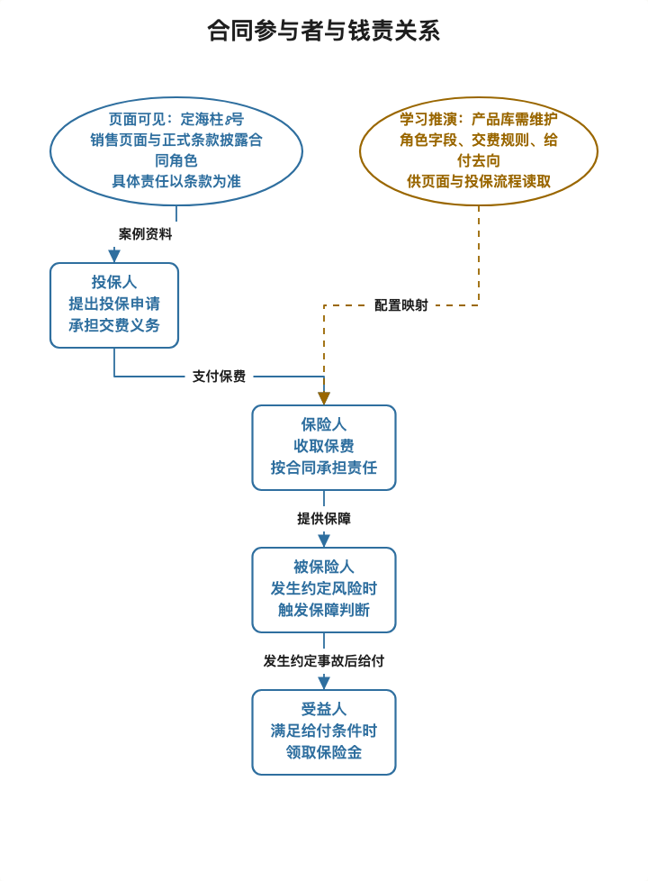
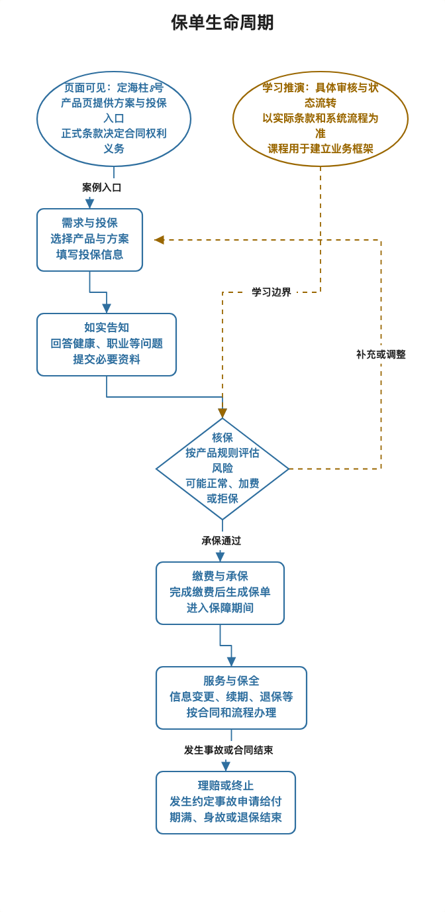
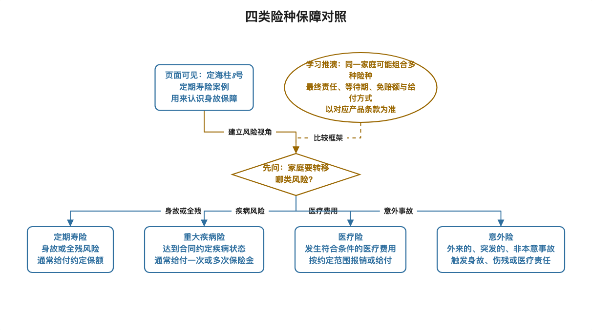
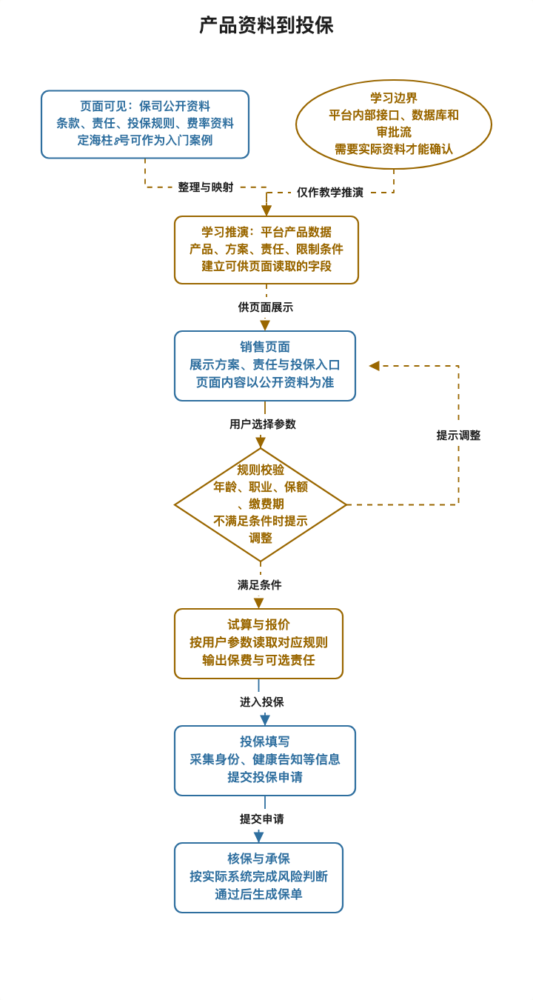

# 保险业务从零到产品库：十日入门教材

> 已有更完整的四周互动课程。建议从[四周课程入口](../01_四周互动课程/从这里开始.md)开始，本十日教材作为快速复习。

> 面向：有产品经理经验、保险知识需要重新打底、准备平安金管家用户增长岗位面试的学习者  
> 学习安排：2026 年 9 月 29 日至 10 月 8 日，每天约 1 小时  
> 案例观察日期：2026 年 9 月 28 日。产品页面及规则可能更新，学习和面试前请回到来源复核。

## 目录

1. [从这里开始](#从这里开始)
2. [十天总览](#十天总览)
3. [先建立一张保险地图](#先建立一张保险地图)
4. [第 1 讲：保险在解决什么问题](#day-01)
5. [第 2 讲：读懂一份保险合同](#day-02)
6. [第 3 讲：用定海柱8号拆解一款定期寿险](#day-03)
7. [第 4 讲：一张保单从投保到理赔](#day-04)
8. [第 5 讲：四类常见人身险](#day-05)
9. [第 6 讲：年金险、现金价值和利益演示](#day-06)
10. [第 7 讲：保险公司、经纪平台与渠道](#day-07)
11. [第 8 讲：保险产品库是什么](#day-08)
12. [第 9 讲：PM 如何设计、联调和验收](#day-09)
13. [第 10 讲：综合拆解与平安面试表达](#day-10)
14. [保险术语小词典](#保险术语小词典)
15. [资料与进阶阅读](#资料与进阶阅读)
16. [每日复习记录](#每日复习记录)

## 从这里开始

保险术语容易让人一开始就迷路。本教材先从一个家庭为什么需要保险讲起，再读一款真实定期寿险，接着认识重疾险、医疗险和年金险，最后再把产品资料拆成产品库能管理的数据和规则。

配套按天执行的[十日学习表](03_保险从零到产品库_十日学习表.md)，以及[HTML 阅读版](02_保险从零到产品库_十日入门教材.html)。

每一天按同一节奏学习：

1. 阅读约 35 分钟，先理解故事和图，再看术语。
2. 完成约 15 分钟练习，尽量先自己说，再看参考答案。
3. 用约 10 分钟复述前一天的核心内容。记不牢就回看对应小节。

内容标记说明：

| 标记 | 怎么理解 |
| --- | --- |
| 【页面可见】 | 慧择产品页展示的信息，阅读时记录页面与查看日期 |
| 【条款原文】 | 保险合同或正式产品文件中的约定，具体权益以投保时合同为准 |
| 【行业常识】 | 用来理解保险业务的一般解释，具体产品会有差别 |
| 【学习推演】 | 为学习产品设计而构造的后台或系统示例，不代表公司真实实现 |
| 【个人经历待确认】 | 需要你回忆项目材料后才能写成“我做过”的事实 |

## 十天总览

| 日期 | 主题 | 当天输出 | 进阶阅读 |
| --- | --- | --- | --- |
| 9 月 29 日 | 保险在解决什么问题 | 画出投保人、被保险人、保险人、受益人的关系 | 教程 0101 |
| 9 月 30 日 | 读懂一份保险合同 | 用白话解释责任、保额、保费、期间、交费和免责 | 教程 0102 |
| 10 月 1 日 | 拆解定海柱8号定期寿险 | 讲清页面名称、备案名称、承保方、销售方和责任 | 本文第 3 讲，定海柱条款 |
| 10 月 2 日 | 一张保单从投保到理赔 | 默画保单生命周期，分清等待期、犹豫期和宽限期 | 教程 0202 |
| 10 月 3 日 | 四类常见人身险 | 为家庭风险选择定寿、重疾、医疗或意外保障 | 教程 0201 |
| 10 月 4 日 | 年金险与利益演示 | 区分保费、领取、现金价值和演示利益 | 年金试算图解手册 |
| 10 月 5 日 | 保险公司、经纪平台与渠道 | 画出各参与方交接关系 | 平安研究与教程 0101 |
| 10 月 6 日 | 保险产品库是什么 | 画出产品、方案、责任、条款、费率、规则和版本 | 教程 0301 至 0304 |
| 10 月 7 日 | PM 如何设计和验收配置 | 完成一页字段映射及验收样例 | 年金试算图解手册 |
| 10 月 8 日 | 综合练习与面试表达 | 完成五分钟产品拆解及真实项目口述 | 15 讲面试部分 |

## 先建立一张保险地图

保险可以先按四个问题理解：

1. **谁交钱？**投保人通常申请购买并交纳保险费。
2. **谁被保障？**被保险人是保险合同保障的对象。
3. **发生什么事会给付？**合同写明保险责任、触发条件和除外责任。
4. **钱给谁？**根据责任类型，给付对象可能是被保险人、受益人或其他合同约定对象。

买保险不等于把所有风险都交给保险公司。保险公司按合同承担约定风险，客户按约交费、如实填写投保信息，并在需要时按流程申请保险金。PM 要把这些约定转成用户能看懂、系统能校验、各端能一致使用的信息。

[查看图解](../../../90_内部材料_无需阅读/02_可编辑图源/十日复习/01_合同参与者.svg)

## 第 1 讲｜保险在解决什么问题

### 生活问题

家庭收入主要来自一位成年人时，如果这位家庭成员身故、患病或失去劳动能力，家庭会同时面对收入减少和支出增加。保险用事先约定的保费，换取未来发生特定风险时按合同给付的安排。

### 白话解释

保险把许多人的风险放在一个共同的资金池中。保险公司根据产品规则、精算假设和监管要求确定承保方式与价格，再依据合同处理保险事故。对个人来说，关键是提前确认保障对象、保障范围、额度、期限和除外约定。

先记住四个角色：

| 角色 | 白话理解 | 定期寿险例子 |
| --- | --- | --- |
| 投保人 | 办理投保并交费的人 | 为自己或符合规则的家人申请投保的人 |
| 被保险人 | 发生约定风险时受保障的人 | 页面所选的被保障对象 |
| 保险人 | 承担合同保险责任的保险公司 | 本案例为国富人寿 |
| 受益人 | 符合条件时领取身故保险金的人 | 按合同和投保约定确定的人 |

投保人、被保险人和受益人可以是同一个人，也可以是不同的人，实际关系须符合保险利益等法律和产品要求。看页面时先找“承保机构”和“销售机构”，再找合同名称，避免把销售平台误认为承担保险责任的一方。

### 产品经理视角

一个保险页面至少要帮助用户回答：我买的是什么、谁提供保障、哪些情况赔、哪些情况不赔、需要交多少钱、保障多久、出险后怎么申请。页面入口、详情页、投保表单和合同材料要保持一致。

### 练习与答案

**练习：**若家中主要收入者希望身故后给家人留一笔钱，最先要确认哪三项？  
**参考：**谁是被保险人、身故责任的条件与额度、受益人及投保关系。之后还要看保费、保障期间、免责和健康告知。

## 第 2 讲｜读懂一份保险合同

### 生活问题

用户看到“最高赔 100 万”时，很容易把它理解成任何情况都能拿到 100 万。合同会进一步说明什么事件、什么条件、什么时间范围内才承担责任。

### 白话解释

| 概念 | 白话理解 | 页面或合同里看什么 |
| --- | --- | --- |
| 保险责任 | 保险公司承诺处理的约定风险 | 身故、全残、疾病、医疗费用或生存给付等 |
| 保险金额/保额 | 某项责任的约定金额或计算基础 | 基本保险金额、分项额度、给付比例 |
| 保险费/保费 | 投保人为合同支付的钱 | 首期、续期、年交或其他交费频率 |
| 保险期间 | 保障从何时开始，到何时结束 | 10 年、30 年或至某年龄等 |
| 交费期间 | 需要交保费多长时间 | 趸交、若干年交或交至某年龄 |
| 免责条款 | 合同明确约定不承担保险责任的情况 | 免责章节、说明和投保提示 |

再把三个时间词分开：

1. **等待期**：合同开始后，某些非意外风险要经过一段时间才按完整约定承担责任，具体看条款。
2. **犹豫期**：收到合同后的一段审视时间，消费者可按条款申请解除合同。
3. **宽限期**：续期保费没有按时交纳时，合同可能给予的补交时间，适用规则以合同为准。

这三个时间词解决的问题不同，系统字段、页面提示和客服解释都不能混成一个“保险冷静期”。

### 产品经理视角

把合同做成页面时，不能只把标题和营销文案录入后台。需要维护可追溯的责任说明、限制条件、时间规则、保费输入、投保须知和正式文件链接。影响用户判断的条款信息需要在决策位置清楚呈现。

### 练习与答案

**练习：**保费交 20 年、保障到 70 岁，这两个“20”和“70”分别对应什么？  
**参考：**20 年是交费期间，70 岁通常描述保险期间终点。两者不能互换。

## 第 3 讲｜用定海柱8号拆解一款定期寿险

### 真实页面

本讲以[慧择定海柱8号定期寿险页面](https://www.huize.com/apps/cps/index/product/detail?DProtectPlanId=108801&prodId=104154&planId=108801)为案例，并参考[正式条款](https://files2.huizecdn.com/file3/M00/D6/5F/rBYA3GnKUXqAdLVQAAU4BAbXNV8711.pdf)。以下是 2026 年 9 月 28 日查看到的信息，页面以后可能变化。

| 要素 | 页面或条款所示 | 学习时怎么理解 |
| --- | --- | --- |
| 销售名称 | 定海柱8号定期寿险（互联网） | 面向用户展示的产品名 |
| 备案名称 | 国富人寿齐家骏达2026定期寿险（互联网） | 与正式产品文件核对的名称 |
| 承保机构 | 国富人寿保险股份有限公司 | 承担合同保险责任的保险公司 |
| 销售机构 | 慧择保险经纪有限公司 | 展示并提供销售服务的平台机构 |
| 基本责任 | 身故或全残保险金 | 具体触发和给付方式以条款为准 |
| 可选责任 | 猝死关爱金、身故或全残特别关爱金等 | 选择后会影响责任组合和报价 |
| 投保规则 | 页面披露投保年龄、保障期间、交费期间、保额及职业限制 | 多项条件共同决定组合能否提交 |
| 期间说明 | 页面显示等待期 90 天、犹豫期 15 天 | 一个属于责任等待规则，一个属于签收后的审视期 |

条款开头还解释了投保人、被保险人、受益人和保险人的定义。它把页面上的词和合同主体连接起来。可选责任也不是一段额外文案，它会改变保障内容，可能也会影响费率与可投规则。

### 产品经理视角

读一款产品时依次找：销售名称、备案名称、承保机构、销售机构、主条款、基本责任、可选责任、保障与交费期间、投保限制、价格来源和资料版本。页面上出现产品名，只说明它是用户认知入口；合同文件才是理解责任的依据。

### 练习与答案

**练习：**慧择页面写“定海柱8号”，承保公司是国富人寿。谁承担合同责任？“定海柱8号”和备案名称为什么都要保存？  
**参考：**国富人寿承担合同约定的保险责任。销售名称帮助用户识别产品，备案名称用于与条款等正式资料建立对应关系。

## 第 4 讲｜一张保单从投保到理赔

### 白话流程

[查看图解](../../../90_内部材料_无需阅读/02_可编辑图源/十日复习/02_保单生命周期.svg)

1. **了解与选产品**：阅读责任、价格、限制和资料。
2. **填写投保信息**：填写投保人、被保险人、受益人及健康告知等信息。
3. **核保**：保险公司评估风险，可能标准承保、要求补充材料、给出其他承保条件或拒绝承保。产品流程与结果以实际规则为准。
4. **缴费与承保**：按要求完成缴费，保险公司确认承保并出具合同凭证。
5. **保单服务**：查询合同、交续期保费、申请信息变更或其他合同服务。
6. **保险事故与理赔**：发生合同约定的保险事故后报案、提交材料，保险公司审核并按合同处理。

合同有效后还可能发生续期、退保、复效、减保等保全事项。“保全”是保险合同成立后，对合同信息或权益进行约定范围内的服务处理。产品库和保单系统需要知道生效时使用的产品规则，避免更新后的展示影响已经成立的合同。

### 产品经理视角

逐步检查用户能否继续，系统应提供什么状态和反馈，资料是否需要复用，出现异常由哪个角色处理。增长指标也应按步骤观察，不能只看最终支付按钮点击量。

### 练习与答案

**练习：**用户完成支付后页面暂时没有保单，PM 先确认哪几件事？  
**参考：**交易是否成功、承保是否完成、出单状态是否延迟、用户收到什么解释、何时升级人工处理，以及后续能否查到合同。不能仅凭扣款成功就向用户承诺已承保。

## 第 5 讲｜定寿、重疾、医疗和意外险有什么区别

### 先看四种保障方式

[查看图解](../../../90_内部材料_无需阅读/02_可编辑图源/十日复习/03_险种保障对照.svg)

| 险种 | 主要处理的问题 | 常见给付方式 | 读产品时先看 |
| --- | --- | --- | --- |
| 定期寿险 | 保障期间内的身故等家庭收入风险 | 符合合同条件时按约给付 | 保障期间、保额、健康告知、免责、受益人 |
| 重疾险 | 符合合同疾病定义时的收入或康复资金需求 | 通常按合同约定给付保险金 | 疾病定义、轻中重症责任、给付次数、等待期 |
| 医疗险 | 发生符合条件的医疗费用 | 通常依约报销符合范围的费用 | 免赔额、报销范围、比例、续保条件 |
| 意外险 | 外来的、突发的意外风险 | 按身故伤残或医疗责任约定处理 | 意外定义、伤残标准、职业和地域限制 |

这是方便学习的产品类型对照，不替代法律分类或条款判断。市场产品可能把多种责任放进同一张保单，也可能附加其他服务。判断保障内容要逐项看责任条款。

用已有[达尔文12号重疾险案例](../../02_产品案例/02_达尔文12号/01_达尔文12号产品库案例讲解.md)与定海柱8号对比：定寿围绕身故或全残责任；重疾险围绕疾病定义和分级责任。两款都要考虑年龄、交费期间、责任选择和核保，但具体字段与规则会不同。

### 产品经理视角

险种不同，用户决策问题、页面解释、投保校验和报价输入也不同。定寿页面重点解释家庭责任与免责；重疾页面重点解释疾病责任；医疗页面重点解释费用范围与续保；年金页面重点解释领取现金流和非保证利益。

### 练习与答案

**练习：**“生病后拿发票报销住院费用”和“符合疾病定义后按约拿一笔钱”分别更接近哪种产品？  
**参考：**前者更接近医疗险的费用补偿方式，后者更接近重疾险的给付方式。实际给付仍依条款。

## 第 6 讲｜年金险、现金价值和利益演示

### 生活问题

有些家庭希望把一部分长期资金安排为未来某个阶段领取。年金险通过合同约定生存给付时间和条件，帮助用户安排未来现金流。它与定寿、医疗的保障重点不同。

### 白话解释

读年金或长期储蓄型保险时，先把不同数字分开：

| 名词 | 白话解释 | 不能混淆成 |
| --- | --- | --- |
| 保费 | 客户按约支付的钱 | 账户余额或未来收益 |
| 年金领取 | 达到合同约定时点和条件后的给付 | 某年退保能拿回的钱 |
| 现金价值 | 特定保单年度解除合同等情形涉及的价值 | 每年固定可以领取的年金 |
| 保证利益 | 合同约定可以保证的利益 | 演示表中所有数值 |
| 非保证利益 | 依实际经营或结算结果变化的利益 | 保证收益 |

本教材不手算精算结果。PM 入门阶段先练习看清现金流的时间点、保证与非保证部分、缴费条件、演示口径和页面标签。

### 连接你的经历

你确认做过年金试算或计划书相关需求设计、联调和验收。可以迁移的产品能力包括定义用户输入、明确利益展示口径、核对页面与计划书输出、准备样例并验收。具体产品名称、接口字段、故障原因和验收结果仍要从你的项目记忆或材料确认，教材不替你补写。

### 练习与答案

**练习：**某页同时列出“第 10 年领取金额”和“第 10 年现金价值”，为什么不能直接把两者相加并称为保证收益？  
**参考：**两者含义、支付条件和合同依据可能不同。还需核对是否可同时获得、利益是否保证、计算口径和时间点。

## 第 7 讲｜保险公司、经纪平台与渠道

### 白话关系

保险公司设计并承保产品，承担合同约定的风险和服务责任。保险经纪或代理销售机构依照其角色提供产品展示、咨询和投保服务。互联网平台把产品资料、用户交互、试算、投保入口和服务入口放在一起，用户最终与谁订立合同须看合同资料。

### 保险公司如何经营

【行业常识】可以先把经营过程想成四步：客户交纳保费，保险公司按合同承担未来给付义务，为这些义务计提准备金并支付经营费用，同时管理投资资产。保险公司还要面对赔付风险、费用、投资收益、资本和长期现金流等约束。因此，收到的保费不能直接等同于利润。

面试增长岗位时先分清几个指标：

| 指标 | 白话含义 | 增长 PM 为什么要看 |
| --- | --- | --- |
| 新单保费 | 统计期内新签合同对应的保费 | 看新业务规模，但不能单独代表业务质量 |
| 续期保费 | 以前签的合同在当前期间继续交纳的保费 | 看存量业务及持续经营情况 |
| 继续率 | 到约定时间仍继续交费的保单占比，具体口径要看统计定义 | 早期成交之后的持续情况会影响长期业务表现 |
| 新业务价值 | 基于精算假设估算的新单未来预期利润折现值 | 用于理解保费规模之外的业务价值，PM 不需要自行精算 |

初学者可以先记住：增长方案不能只问“多卖了多少”，也要看适配人群、后续服务、持续交费、退保投诉和销售合规。不同公司和渠道的考核口径可能不同，面试引用数字前应核对当期公开披露。

【页面可见】定海柱8号页面披露国富人寿为承保机构、慧择保险经纪有限公司为销售机构，并提供产品责任、投保须知和条款链接。这些页面事实可以用于理解参与方。

【行业常识】保险公司的产品团队、精算、核保、运营、合规、研发和销售渠道需要配合产品上线。具体部门名称、审批顺序、后台能力和系统接口因公司而异。平台 PM 应先确认自己所在机构的责任边界，再设计对接流程。

### 产品经理视角

产品接入可能包含资料收集、规则核验、数据录入、页面展示、报价或试算、投保接口联调、样例验收、上线观察和版本更新。经纪平台管理销售与服务所需的产品数据，保司产品工厂管理产品规则及其正式生效。两边需要映射，不能从外部销售页猜测保司内部后台。

### 练习与答案

**练习：**页面展示产品名称和“立即投保”按钮，是否足以判断销售平台就是承保公司？  
**参考：**不足。分别查页面披露的销售机构、承保机构和正式合同主体。

## 第 8 讲｜保险产品库是什么

### 生活类比

可以把产品库理解为一套受规则约束的产品资料管理能力。用户页面要展示什么、试算器需要哪些输入、投保流程怎样校验，需要使用一致并且有效的产品信息。

[查看图解](../../../90_内部材料_无需阅读/02_可编辑图源/十日复习/04_产品资料到投保.svg)

产品库常见业务对象可以先记成七项：

| 对象 | 要回答的问题 | 定海柱8号学习例子 |
| --- | --- | --- |
| 产品 | 这款保险整体是什么 | 定海柱8号定期寿险（互联网） |
| 计划 | 当前销售组合包含什么 | 公开链接可确认页面计划标识 `108801`，完整官方计划清单未公开 |
| 责任 | 什么情形下提供什么保障 | 身故或全残基本责任，另有猝死、45 岁前特别关爱、交通意外和家庭守护等可选责任 |
| 条款 | 正式合同依据是什么 | 国富人寿齐家骏达2026定期寿险条款 |
| 投保资格或组合规则 | 哪些人和组合可进入申请 | 年龄、职业、保额、期间等规则 |
| 费率或报价 | 这些输入对应什么价格 | 需要按有效费率资料或授权报价服务计算 |
| 版本 | 这次页面和试算用了哪套资料 | 需要实际平台系统定义版本方式 |

公开页面没有给出可确认的完整计划名称列表，页面数据中的 `planName` 为空。责任组合和“含”或“不含”的选项可以组成一次报价和投保方案，具体是否在后台建成独立计划需要查看目标系统数据模型。产品页默认可选责任为“不含”，这只能说明默认展示状态。

产品库还要分别管理投保资格或组合规则与核保规则。前者校验年龄、保额、职业、期间和责任组合是否可以申请，后者根据健康告知和风险信息决定承保条件。条款、责任、费率和现价或利益是四层数据模型，版本和渠道决定消费端拿到哪一套有效资料。定期寿险是否有现金价值以及某个时点对应的金额，要按条款和现金价值表确认，不能因为当前重点是保障责任就省略这条核对。

为深入学习具体责任、计划标识、规则边界、字段映射、版本和案例排查，请阅读[《产品库深度教学：定海柱8号案例》](../../02_产品案例/01_定海柱8号/01_定海柱8号产品库深度案例.md)，也可打开[HTML 阅读版](../../02_产品案例/01_定海柱8号/02_定海柱8号产品库深度案例_阅读版.html)。其中的责任组合、接口和后台字段均标注为公开事实或学习推演，不代替正式条款或目标系统确认。

### 产品经理视角

从页面往上游问：这段责任说明来自哪里？价格有哪些输入？用户选项如何映射计划？改变年龄或责任后哪些组合失效？改版何时生效？历史试算如何追溯？这些问题会形成需求范围、字段清单、规则表、接口约定和验收样例。

### 练习与答案

**练习：**用户切换保障期间后，可选责任和缴费期应如何处理？  
**参考：**先按新方案重新加载允许的缴费期和责任；检查原有选择是否仍有效；重新校验报价输入并向用户说明被清除或变更的选择。具体系统做法由需求和产品规则确定。再追问：页面里的 `planId=108801` 是官方计划名称吗？参考答案是，当前公开链接只足以确认页面计划标识，不能从空的 `planName` 推导官方计划清单。

## 第 9 讲｜PM 如何设计、联调和验收

### 一页需求模板

| 需求部分 | 要写清楚的内容 |
| --- | --- |
| 用户问题 | 用户在哪一步看不懂、无法选择或得到不一致结果 |
| 资料依据 | 对应条款、投保须知、责任表、费率资料及版本 |
| 输入字段 | 用户提供什么信息，类型和取值范围是什么 |
| 业务规则 | 哪些组合可用，哪些需要拦截或转人工确认 |
| 输出展示 | 页面、试算、计划书或投保接口应呈现什么 |
| 异常处理 | 资料缺失、组合无效、报价失败、接口超时时怎样反馈 |
| 验收样例 | 正常值、边界值、错误值及预期结果 |
| 版本记录 | 生效时间、适用范围、历史结果和回归范围 |

### 用定寿产品练习验收

以下只基于公开页面字段设计验收练习，不代表实际销售系统的完整规则：

1. 页面销售名称与备案名称能分别展示，承保机构和销售机构不混淆。
2. 用户切换保障期间时，展示对应的可选交费期间。
3. 保额、职业与年龄边界按当前有效资料提示，提交前再次校验。
4. 选择可选责任后，保障说明和报价输入同步更新。
5. 页面资料能跳转到适用条款和投保须知。
6. 页面规则更新后，能确认新旧页面和投保校验使用的资料范围。

### 典型问题定位

| 发现的问题 | 先查什么 | 回归什么 |
| --- | --- | --- |
| 页面允许选择不符合年龄规则的组合 | 年龄口径、保障期间、交费期间及有效规则版本 | 年龄边界、切换期间后的规则刷新 |
| 选择附加责任后价格没变化 | 责任是否进入报价输入、费率资料是否对应 | 未选和选中责任的权威报价样例 |
| 页面与计划书责任文字不同 | 两端数据来源、文案映射、资料版本 | 同一产品组合的页面与计划书内容 |
| 产品更新后旧试算无法复现 | 历史输入、资料版本、报价结果留存策略 | 旧记录展示、新试算规则和继续投保校验 |

遇到问题时按“复现输入、确认资料版本、定位字段或规则、协调负责人、修正后回归”处理。只有你亲自处理过的问题才改写成自己的项目故事。

### 练习与答案

**练习：**费率或现价对不上时，你会先问哪三件事？  
**参考：**比较的是不是同一产品计划与责任组合；输入的年龄、性别、保额、交费期等口径是否一致；页面、接口和参考资料是否使用同一生效版本。随后准备最小复现样例，再找对应业务、研发或测试共同定位。

## 第 10 讲｜综合拆解与平安面试表达

### 五分钟产品拆解顺序

1. 先说产品销售名、备案名、承保公司和销售机构。
2. 说明主要保障对象、基本责任和可选责任。
3. 解释保障期间、交费期间和主要投保限制。
4. 描述从产品资料到页面、试算和投保校验的数据使用过程。
5. 区分页面事实、公开条款、行业常识、系统推演和个人经历。

### 你的项目口述模板

> 我在深蓝保参与过年金试算或计划书相关需求，负责需求定义，并参与联调与验收。当时的用户问题是【回忆确认】，我定义或确认的输入输出是【回忆确认】，联调主要核对【回忆确认】，验收使用了【回忆确认的样例和方法】。现在我用定海柱8号定寿案例练习产品拆解，能从销售页面追到承保主体、正式条款、责任和投保规则，再推导页面与投保校验需要的数据。后半段是基于公开资料做的业务分析。

不要把寿险案例说成你的深蓝保项目，也不要把保险公司内部发布流程写成亲历。真实项目叙事的每项动作都应能对应到需求文档、验收记录、联调记录或你的明确回忆。

### 最终自测

1. 不看教材，画出四个合同参与方及各自关系。
2. 不看教材，画出投保、核保、承保、保全、理赔的主要顺序。
3. 用两分钟对比定寿、重疾、医疗和意外险。
4. 用三分钟解释产品、计划、责任、条款、费率、规则与版本。
5. 用五分钟拆解定海柱8号页面，并指出至少两项要回到条款确认的信息。
6. 用九十秒说出深蓝保年金试算项目中你确认做过的需求、联调和验收工作。

**通过标准：**前五题能讲清业务对象和事实来源；第六题只讲可确认的亲历内容。卡住的题回到对应课程复习，不靠背术语补空白。

## 保险术语小词典

| 术语 | 白话解释 |
| --- | --- |
| 投保 | 申请购买保险并填写合同所需信息 |
| 核保 | 保险公司按产品规则评估是否接受风险以及适用条件 |
| 承保 | 保险公司同意接受投保并按合同承担责任 |
| 保全 | 保单生效后办理合同信息或权益服务 |
| 受益人 | 按合同约定领取相应保险金的人 |
| 现金价值 | 合同在特定时间和情形下对应的价值，规则见条款 |
| 费率 | 保险价格计算所依据的比例、表或其他规则 |
| 版本 | 一组有来源和适用时间的产品资料或规则状态 |
| 责任 | 合同约定发生某类情况时保险公司提供的保障或给付 |
| 经纪平台 | 按其业务资格与角色提供保险产品销售或服务的机构 |

## 资料与进阶阅读

1. [定海柱8号慧择产品页](https://www.huize.com/apps/cps/index/product/detail?DProtectPlanId=108801&prodId=104154&planId=108801)
2. [国富人寿齐家骏达2026定期寿险条款](https://files2.huizecdn.com/file3/M00/D6/5F/rBYA3GnKUXqAdLVQAAU4BAbXNV8711.pdf)
3. [达尔文12号重疾险产品库案例](../../02_产品案例/02_达尔文12号/01_达尔文12号产品库案例讲解.md)
4. [深蓝保年金试算和产品库实战手册](../../03_平安面试准备/01_深蓝保产品库面试手册.md)
5. 原 15 讲课程目录，从本教材第 1 至第 7 讲后再按需进入产品库专题。

## 每日复习记录

| 日期 | 已读 | 自测结果 | 需要再讲一次的词或流程 |
| --- | --- | --- | --- |
| 9 月 29 日 | ☐ |  |  |
| 9 月 30 日 | ☐ |  |  |
| 10 月 1 日 | ☐ |  |  |
| 10 月 2 日 | ☐ |  |  |
| 10 月 3 日 | ☐ |  |  |
| 10 月 4 日 | ☐ |  |  |
| 10 月 5 日 | ☐ |  |  |
| 10 月 6 日 | ☐ |  |  |
| 10 月 7 日 | ☐ |  |  |
| 10 月 8 日 | ☐ |  |  |
