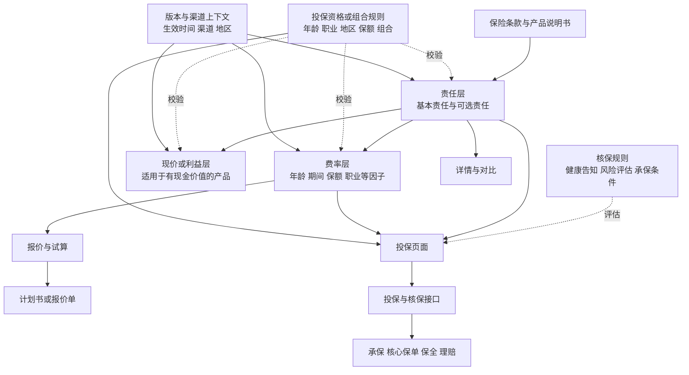

# 保险结构化产品库深度教学：用定海柱8号读懂一款产品

> 用途：给产品经理做一次从公开产品页走到产品库后台的完整练习。本文把公开事实、通用系统设计和学习假设分开写。文中的后台字段、接口和页面仅用于教学，不能当作慧择、国富人寿或平安的内部实现。

## 1. 先回答三个最容易混淆的问题

### 1.1 这款保险到底是什么

本案例来自慧择的[定海柱8号定期寿险（互联网）产品页](https://www.huize.com/apps/cps/index/product/detail?DProtectPlanId=108801&prodId=104154&planId=108801)。在页面可见资料中，可以确认以下事实：

| 项目 | 本案例能确认的内容 | 证据边界 |
| --- | --- | --- |
| 销售名称 | 定海柱8号定期寿险（互联网） | 页面披露名 |
| 备案名称 | 国富人寿齐家骏达2026定期寿险（互联网） | 页面投保须知 |
| 承保机构 | 国富人寿保险股份有限公司 | 页面投保须知 |
| 销售机构 | 慧择保险经纪有限公司 | 页面重要提示 |
| 页面产品标识 | `prodId=104154` | URL 参数 |
| 页面计划标识 | `planId=108801`，同时出现在 `DProtectPlanId` | URL 参数 |
| 计划名称字段 | 抓取到的页面数据中 `planName` 为空 | 不能从空字段推导官方计划名称 |
| 公开计划清单 | 当前链接只验证到计划标识 108801 | 不能据此断言全产品只有一个计划 |

因此，面试或学习时可以这样说：

> 我用慧择页面上的定海柱8号定期寿险做产品库拆解。公开链接能确认产品名称、备案名称、承保机构、销售机构，以及 `prodId=104154` 和 `planId=108801` 这组页面标识。页面没有给出可供我确认的完整计划名称清单，所以我把 108801 称为本链接对应的销售页计划标识，把责任选择和投保输入作为该页面的配置状态来分析。

### 1.2 “计划有哪些”应该怎样回答

这里要分三层回答：

1. **公开事实层**：本链接能确认一个页面计划标识 `108801`。页面抓取数据中的计划名称为空，公开资料没有给出完整的官方计划列表。
2. **用户选择层**：页面允许用户输入保障期间、交费期间、基本保险金额、职业等信息，并对可选责任做“含”或“不含”的选择。这些选择会组成一次报价和投保方案。
3. **产品库设计层**：系统可以把每种允许组合存成计划，或者把计划作为责任组合模板，再把年龄、期间、保额、职业等作为方案参数。两种方式都可能成立，最终取决于平台和保司的数据模型。

下面这些名称是本文为学习设计的组合示例，不能当作官方计划名称：

| 教学组合 | 基本责任 | 可选责任示例 | 作用 |
| --- | --- | --- | --- |
| 组合 A | 身故或全残 | 全部不含 | 用于理解默认页面状态 |
| 组合 B | 身故或全残 | 猝死额外赔 | 用于练习责任叠加和年龄条件 |
| 组合 C | 身故或全残 | 45 岁前身故或全残特别关爱金 | 用于练习年龄边界 |
| 组合 D | 身故或全残 | 公共交通、航空、法定节假日驾车三项一起选择 | 用于练习捆绑条件 |
| 组合 E | 身故或全残 | 家庭守护身故或全残关爱金 | 用于练习夫妻同事故条件 |

页面默认展示的可选责任为“不含”，这只能说明默认展示状态。真实可销售组合还要通过页面交互、费率资料、核保校验和投保接口确认。

### 1.3 产品库到底管理什么

产品库不是一张只放产品名称的目录。它要把一份产品资料拆成可复用的数据、责任、规则、价格依据、版本和分发状态，让详情页、对比页、报价、投保、计划书、保单服务和理赔入口使用相互对应的信息。

对产品经理来说，可以把产品库看成三栏知识地图：

| 业务概念 | 后台设计 | 技术协作 |
| --- | --- | --- |
| 产品卖什么，谁承保，保障谁 | 产品主档、销售名称、备案名称、承保机构、险种类型 | 产品主键、外部编码、状态和权限 |
| 发生什么情况给什么钱 | 责任定义、触发条件、给付比例、除外关联 | 责任编码、条件表达式、展示文案 |
| 谁能申请、哪些组合可选、最终是否承保 | 投保资格或组合规则、核保规则、渠道规则 | 规则服务、校验接口、错误码 |
| 输入怎样变成价格 | 费率表、费率因子、报价服务或保司报价接口 | 请求字段、精度、币种、超时和追踪号 |
| 哪套资料在什么时候有效 | 版本、审批、发布、生效、停售 | 版本号、有效起止时间、审计日志 |
| 页面和流程怎样使用资料 | 消费场景、内容配置、数据分发 | 产品详情、报价、投保、计划书、保单服务 API |

## 2. 一张总图：从条款到消费端

产品库设计可以用四层模型理解。四层分别是条款层、责任层、费率层和现价层。投保规则与核保规则横向贯穿四层，版本和渠道决定某一份数据是否能被消费。



如果当前阅读器不渲染 Mermaid，可以按下面这条数据流理解：

```text
条款和产品资料
      ↓ 拆字段、拆责任、记录来源
产品主档、计划、责任、规则、费率、版本
      ↓ 按渠道和生效时间选择有效配置
详情页 / 对比页 / 报价器 / 投保页 / 计划书
      ↓ 请求报价、核保和承保服务
报价结果 / 投保结果 / 电子保单
      ↓ 使用保单成立时的约定和后续服务规则
保全、理赔、客户服务
```

## 3. 定海柱8号的公开责任拆解

以下责任名称与金额比例以产品页和正式条款为依据。正式合同、投保时的电子投保书和当时有效的产品文件具有更高的解释优先级。

### 3.1 基本责任

| 责任 | 触发条件 | 给付理解 | 业务设计要点 | 来源 |
| --- | --- | --- | --- | --- |
| 身故或全残基本责任 | 保险期间内发生合同约定的身故或全残 | 等待期内因非意外原因发生时，按条款处理已交保费；因意外或等待期后发生时，按基本保险金额给付 | 身故与全残通常需要互斥处理，避免同一保险事故重复给付 | 条款第 8 条，页面等待期说明 |

条款说明身故保险金和全残保险金在合同约定下互斥。产品库要把“触发条件”“等待期处理”“给付金额”“互斥关系”分别存储，页面文案可以合并展示，理赔和核心系统仍要能够识别责任编码。

### 3.2 可选责任

| 可选责任 | 保障内容 | 金额或比例 | 关键条件 | 产品库落点 |
| --- | --- | --- | --- | --- |
| 可选责任一，猝死额外赔 | 在基本责任之外增加猝死给付 | 基本保险金额的 30% | 以条款对猝死的定义、等待期及年龄时点为准。条款约定的时间条件需要原文核对 | 责任编码、适用期间、给付比例、定义引用 |
| 可选责任二，身故或全残特别关爱金 | 对特定年龄阶段的身故或全残增加给付 | 基本保险金额的 50% | 页面提示 45 周岁及以上不能选择。条款还需核对首个保单周年日等时间条件 | 责任编码、年龄上限、时间窗、组合限制 |
| 可选责任三，交通意外额外赔组合 | 陆路或水路公共交通、航空、法定节假日驾车三项一起选择 | 陆路或水路公共交通 100%，航空 400%，法定节假日驾车 50% | 页面和条款约定三项需同时选择，具体事故定义、叠加方式和适用场景以条款为准 | 组合责任组、互斥与必选关系、比例和事故类型 |
| 可选责任四，家庭守护身故或全残关爱金 | 被保险人与配偶因同一事故在约定时间内均身故或全残时增加给付 | 基本保险金额的 100% | 条款约定同一事故及 180 日等条件，需要同时识别被保险人、配偶和事故时间 | 家庭关系、同一事故标识、180 日窗口、责任条件 |

页面标题还展示了“可选猝死额外赔”“可选45岁前额外赔”“夫妻共保保额翻倍”等营销化摘要。摘要适合做入口文案，后台仍要追溯到责任编码和正式条款，不能只存营销标题。

### 3.3 这些责任怎样变成方案

假设学习时输入：30 周岁，被保险人基本保险金额 50 万元，保障 20 年，交费 20 年，选择可选责任一和可选责任二。这个例子只用于字段和规则练习，保费金额未知，也没有证明该组合作为官方计划存在。

可以展开为：

```text
产品：定海柱8号定期寿险（互联网）
页面计划标识：108801
方案参数：
  被保险人年龄 = 30
  基本保险金额 = 500000
  保险期间 = 20年
  交费期间 = 20年交
  职业类别 = 待确认
责任选择：
  基本责任 = 含
  可选责任一，猝死额外赔 = 含
  可选责任二，特别关爱金 = 含，等待年龄规则校验
  可选责任三，交通意外组合 = 不含
  可选责任四，家庭守护 = 不含
报价结果：由有效费率资料或授权报价服务返回
```

系统应在提交报价前重新检查年龄、职业、保额、期间、责任组合和版本。用户修改年龄或期间后，原责任选择可能需要重新判断，价格也要重新计算。

### 3.3 具体金额推演框

下面仍是教学假设，基本保险金额取 50 万元。它用于理解责任比例怎样映射到给付金额，不代表某个官方计划的承保结果：

| 情形 | 计算 | 教学理解 |
| --- | --- | --- |
| 符合条件的身故或全残基本责任 | 50 万 × 100% | 基本给付 50 万元 |
| 等待期后，满足条款对猝死的定义，且选择责任一 | 50 万 × 30% | 猝死额外给付 15 万元 |
| 同时满足责任二的年龄和事故条件，且选择责任二 | 50 万 × 50% | 特别关爱额外给付 25 万元 |
| 选择责任三中的航空责任，满足条款事故条件 | 50 万 × 400% | 航空额外给付 200 万元 |
| 基本责任与航空责任同时满足 | 50 万 + 200 万 | 在合同约定下可能合计 250 万元 |

每一行都要回到条款核对事故定义、等待期、时间窗口和责任之间的给付关系。可选责任三的交通三项在条款约定下只给付其中一项，不能把陆路或水路公共交通、航空、法定节假日驾车三项比例直接相加。责任一和责任二是否能在同一事故中同时给付，也要逐项按条款和同一事故条件核对，不能概括为一律累计。

### 3.4 字段命名的坑：`fullPremium` 不一定是保费

公开页面 HTML 的 `protectTrialItemList.fullPremium` 出现过“10万元/3万元”这样的值。结合页面上下文，这些值看起来更像展示保额或责任金额，不能因为字段名带有 `Premium` 就直接当作保费。产品经理应要求研发提供正式字段协议，确认字段含义、单位、币种、格式和来源，再把它映射到产品库字段。字段名、页面标题和业务含义需要分别核对。

## 4. 投保输入与规则决策表

### 4.1 页面可确认的主要输入

| 输入字段 | 页面公开信息 | PM 要继续确认的点 |
| --- | --- | --- |
| 被保险人年龄 | 18 周岁至 60 周岁，含边界 | 年龄按投保日、生日还是保单生效日计算 |
| 保险期间 | 10 年、20 年、30 年、保至 60 周岁、65 周岁、70 周岁 | 各期间与年龄、交费期间和责任的组合关系 |
| 交费期间 | 一次交清、10 年交、20 年交、30 年交、交至 60 周岁、65 周岁、70 周岁 | 交至某年龄时的年数计算和边界 |
| 基本保险金额 | 最低 10 万元，超过部分为 10 万元整数倍 | 其他人身险风险保额累计限制、渠道上限 |
| 职业类别 | 支持 1 至 6 类；5 类累计基本保额不超过 50 万元，6 类不超过 30 万元 | 职业映射表、特殊职业清单和累计口径 |
| 可选责任二 | 页面提示 45 周岁及以上不能选择 | 45 周岁当天的计算口径、前端提示和接口错误码 |
| 投被保险人关系 | 本人、配偶、父母、子女 | 关系证明和家庭守护责任需要的配偶信息 |
| 地区与服务 | 页面提示国富人寿在广西、贵州设有分支机构，其他区域通过电话和线上服务 | 可售地区、服务时效和渠道限制 |

### 4.2 规则决策表

| 规则编号 | 条件 | 结果 | 需要测试的边界 |
| --- | --- | --- | --- |
| R1 | 年龄小于 18 或大于 60 | 不允许进入投保，提示年龄范围 | 17、18、60、61 |
| R2 | 基本保险金额小于 10 万，或不是 10 万整数倍 | 不允许报价或投保 | 9.9 万、10 万、20 万；15 万单独验证金额步长 |
| R3 | 职业 5 类且累计基本保险金额大于 50 万 | 不允许该金额方案 | 40 万、50 万、60 万 |
| R4 | 职业 6 类且累计基本保险金额大于 30 万 | 不允许该金额方案 | 20 万、30 万、40 万 |
| R5 | 年龄大于等于 45 且选择可选责任二 | 清除或阻止该责任，具体交互需产品确认 | 44 岁 364 天、45 岁当天、45 岁以上 |
| R6 | 选择交通意外额外赔但没有同时选择三项 | 阻止提交，并提示三项需一起选择 | 只选一项、只选两项、三项全选 |
| R7 | 选择家庭守护但缺少配偶信息 | 不能完成相关校验 | 无配偶、关系不符合、两人信息不一致 |
| R8 | 投保资料命中健康告知或核保规则 | 进入智能核保、人工核保或拒保分支，具体结果取决于保司规则 | 正常、补充问询、拒保 |

这些规则的动作可设计为“阻止”“提示后继续”“转核保”“清除选项”四类。后台不能只保存一句文案，还需要保存条件、动作、优先级、错误码和适用版本。

## 5. 费率与报价：能解释输入，不能编造价格

公开产品页提供费率表入口，但在本教学底稿中不把某一金额当作保费。保费可能由保司费率表、费率因子、责任组合、职业、地区、渠道适用范围及获授权的报价口径共同决定，实际计算方式以有效费率资料或授权报价服务为准。

### 5.1 报价输入输出的教学合同

```json
{
  "productId": "104154",
  "planId": "108801",
  "version": "示例版本，待系统确认",
  "insuredAge": 30,
  "basicSumInsured": 500000,
  "policyTerm": "20年",
  "paymentTerm": "20年交",
  "occupationClass": "待填写",
  "optionalBenefits": ["OPTIONAL_01", "OPTIONAL_02"],
  "channel": "huize_web",
  "effectiveAt": "2026-09-28T00:00:00+08:00"
}
```

上面是产品经理用于联调的假设请求，字段名和版本值没有声称来自慧择真实接口。报价响应至少要能回传报价金额、币种、缴费频率、责任摘要、规则校验结果、报价追踪号和引用的产品版本。

### 5.2 PM 验算思路

1. 先确认输入是否命中产品规则，例如年龄、保额、职业和责任组合。
2. 再确认报价服务使用的产品标识、计划标识、费率版本和渠道上下文。
3. 用一组固定样例核对请求和响应，记录金额精度、四舍五入和错误码。
4. 修改一个因子后重新报价，观察只有预期字段变化。
5. 将页面显示、报价响应、计划书摘要和投保请求中的责任与金额逐项对账。

## 6. 产品库的完整设计

### 6.1 业务对象关系

```text
产品 Product
  ├─ 计划 Plan，页面标识可能为 108801
  │    ├─ 基本责任 Basic Benefit
  │    ├─ 可选责任 Optional Benefit
  │    ├─ 允许的方案参数 Parameter Set
  │    └─ 适用渠道 Channel Scope
  ├─ 条款 Clause，正式合同和条款文件
  ├─ 投保资格或组合规则 Application Rule
  ├─ 核保规则 Underwriting Rule
  ├─ 费率或报价 Rate / Quote Rule
  ├─ 内容资料 Content，详情、须知、说明书和链接
  └─ 版本 Product Revision
       ├─ 草稿 Draft
       ├─ 审核中 Review
       ├─ 已发布 Published
       ├─ 已生效 Effective
       └─ 已停售或历史 Historical
```

这里的“计划”可以是单独实体，也可以是保司或平台用一组责任和参数生成的销售方案。真实系统中是否将每一种责任组合建成独立计划，必须查看数据模型或向负责同学确认。

### 6.2 推荐的后台模块

中邮保险产品工厂采购公告公开列举了新产品定义、新产品计划管理、产品改版、计划改版、销售控制、规则库、公共核保、保全、理赔、风险保额、发布、参数、校验、权限、监控和数据分发等模块。这份材料可用于理解产品工厂的能力范围，不能用来推断本案例平台的内部页面。

| 模块 | PM 要设计的重点 | 定海柱8号练习 |
| --- | --- | --- |
| 产品主档 | 名称、备案名称、承保机构、险种、外部标识 | 销售名和备案名分开保存 |
| 计划管理 | 计划标识、责任组合、参数集合、适用渠道 | 记录 `108801`，同时标注计划名称未公开 |
| 责任管理 | 责任编码、触发条件、金额比例、条款引用 | 基本责任和四组可选责任 |
| 条款资料 | 文档、版本、章节、来源链接、生效日期 | 关联正式条款 PDF |
| 投保资格或组合规则 | 条件、动作、优先级、错误码、提示文案 | 年龄、保额、职业、组合约束 |
| 核保规则 | 健康告知、风险评估、核保结论和承保条件 | 命中问询、人工核保或拒保分支 |
| 费率报价 | 因子、费率文件、服务地址、精度 | 不录入未经授权的示例保费 |
| 内容配置 | 详情页摘要、投保须知、营销卡片 | 页面摘要回链正式责任 |
| 生命周期 | 草稿、审批、发布、生效、停售、回滚 | 改版时保留旧版本依据 |
| 分发监控 | 向详情、报价、投保和核心系统发送状态 | 对账请求版本和接收结果 |
| 审计权限 | 操作人、时间、差异、审批意见 | 能追溯谁修改了年龄边界或责任比例 |

### 6.3 资料到产品库的工作流

```text
资料获取
  ↓ 条款、产品说明书、投保须知、费率表、风险保额表
字段拆解
  ↓ 产品、计划、责任、规则、价格因子、内容和版本
录入与映射
  ↓ 建立内部编码，关联外部产品标识和原始资料
复核
  ↓ 格式校验、组合逻辑、条款展示一致性、权威费率或现价底稿
审批与发布
  ↓ 生效时间、渠道范围、版本状态和分发任务
消费端对账
  ↓ 详情、对比、报价、投保、计划书、保单服务和理赔
```

四类校验要分别设计：

| 校验类型 | 例子 | 发现什么问题 |
| --- | --- | --- |
| 格式校验 | 金额必须为 10 万整数倍，年龄是合法数字 | 错误输入或字段类型错误 |
| 组合逻辑校验 | 交通意外三项需同时选，45 岁以上不能选责任二 | 选项之间的依赖和边界错误 |
| 条款与展示一致性 | 页面写 30% 时，责任配置和条款引用也要对应 | 营销文案与合同口径不一致 |
| 权威底稿核对 | 报价、现价或利益演示与有效费率或现价表比对 | 计算服务、录入数据或版本引用错误 |

### 6.4 版本与快照

版本选择至少要考虑业务生效时间、渠道、地区和投保上下文。改版时要明确：

1. 新版本何时可被详情页使用。
2. 新版本何时可报价和投保。
3. 在途报价或投保请求采用什么锁定规则。
4. 已承保保单后续服务和理赔依据哪份合同资料。
5. 旧版本页面是否下线，历史链接如何保留。

“在途单一律按提交时锁版本”“旧单一律读取全量快照”等说法都需要结合具体系统和合同确认。较稳妥的设计是记录保单成立时的产品版本、责任版本、规则引用和合同文档，同时保留可审计的变更记录。具体数据粒度由核心保单系统与产品库协定。

## 7. 保司产品工厂与经纪平台产品库的分工

| 维度 | 保司产品工厂 | 经纪平台或销售平台产品库 |
| --- | --- | --- |
| 权威来源 | 产品备案资料、条款、费率、核保、保全和理赔规则 | 经授权接收的产品资料和销售服务配置 |
| 责任边界 | 决定承保责任、合同规则和核心保单处理 | 负责展示、筛选、报价接入、投保服务和客户协助 |
| 计划与渠道 | 管理产品定义、计划和销售控制 | 建立页面方案、渠道展示和销售范围映射 |
| 价格 | 费率制定或授权报价能力 | 调用报价服务，展示和传递结果 |
| 版本 | 管理正式生效与历史合同依据 | 记录平台消费版本、同步状态和页面内容版本 |
| 出险处理 | 按合同审核和给付 | 接收报案、协助资料准备、同步进度和服务信息 |

中邮公开采购公告说明产品工厂可以向核心业务系统和渠道接入平台分发产品定义参数。IBM 的产品模型文档和 Guidewire 的版本或 edition 文档可以帮助理解通用产品建模思想，例如产品模板、具体保单、有效起止时间和适用分段。它们属于通用系统设计参考，不能直接当作中国保险公司的内部实现依据。

## 8. PM 后台页面如何设计

### 8.1 产品详情页

建议分成四个区块：

1. 基础信息：销售名、备案名、承保机构、销售机构、外部产品标识。
2. 计划和责任：计划标识、责任组、基本责任、可选责任、条款引用。
3. 规则和报价：年龄、期间、保额、职业、关系、报价服务和错误码。
4. 版本和发布：版本号、资料来源、生效时间、渠道、审批记录、分发状态。

### 8.2 责任编辑页

每条责任至少要有：

| 字段 | 例子 | 注意事项 |
| --- | --- | --- |
| responsibilityCode | `BASIC_DEATH_TPD` | 内部编码，不能用营销标题替代 |
| displayName | 身故或全残基本责任 | 页面展示名 |
| trigger | 身故或全残及等待期条件 | 需要引用条款章节 |
| benefitFormula | 基本保险金额 × 100% | 公式或给付规则需要可审计 |
| waitingPeriod | 90 天 | 保单生效或复效后的计算口径需确认 |
| mutuallyExclusiveWith | 身故与全残 | 处理同一事故重复给付 |
| clauseRef | 条款第 8 条 | 便于复核和变更影响分析 |

### 8.3 规则编辑页

规则编辑页要能表达条件和动作，例如：

```json
{
  "ruleCode": "AGE_OPTIONAL_02",
  "when": "insuredAge >= 45 && optionalBenefit02 == true",
  "action": "BLOCK_SUBMIT",
  "errorCode": "OPTIONAL_02_AGE_NOT_ELIGIBLE",
  "message": "45周岁及以上不能选择可选责任二",
  "source": "产品页投保须知及正式条款，待版本绑定",
  "priority": 100
}
```

这段 JSON 是教学示例。真实系统可能使用规则引擎、表格规则、脚本或保司接口。PM 需要把业务条件、动作、错误码、前端提示、接口返回和测试样例写清楚。

## 9. 从页面到保单的完整案例演练

### 9.1 需求背景

假设销售平台要上线定海柱8号的新版详情和投保入口。输入资料包括产品页、投保须知、正式条款、产品说明书、费率表入口和风险保额说明。目标是让用户选定一组方案后，页面、报价和投保请求使用相同的责任与规则口径。

### 9.2 PM 工作拆解

| 阶段 | PM 要做什么 | 需要找谁确认 | 交付物 |
| --- | --- | --- | --- |
| 资料获取 | 收集条款、须知、费率、风险保额和页面内容 | 保司产品、平台运营、合规 | 资料清单和来源表 |
| 字段拆解 | 把产品、计划、责任、规则和内容拆成字段 | 业务专家、研发 | 字段字典和责任映射 |
| 录入映射 | 建内部编码，关联外部 `prodId`、`planId` | 产品库研发、数据同学 | 配置草稿 |
| 复核 | 做四类校验，检查页面与条款口径 | 测试、合规、保司接口人 | 问题清单和修订记录 |
| 联调 | 用正常和边界样例请求报价、核保和投保 | 研发、保司接口、测试 | 联调记录和请求响应 |
| 审批发布 | 确认版本、生效时间、渠道和发布范围 | 运营、合规、发布负责人 | 发布单和回滚方案 |
| 上线对账 | 对比页面、报价、投保和保单结果 | 客服、运营、研发 | 上线观察表 |

### 9.3 一条样例数据流

```text
用户进入详情页
  → 读取产品 104154、计划标识 108801 的有效内容
  → 选择 20 年保障、20 年交、50 万基本保额和责任组合
  → 前端做格式和组合校验
  → 报价服务读取年龄、保额、期间、职业、责任和渠道
  → 返回金额、责任摘要、规则结果和报价追踪号
  → 投保接口再次校验关键规则
  → 核保通过后进入承保和电子保单
  → 保单服务与理赔按合同成立时的有效依据处理
```

## 10. 三个实际工作场景练习

### 场景一：页面写了 30%，报价或计划书却显示另一比例

**发现问题**：详情页可选责任一显示 30%，计划书摘要或报价响应显示了另一比例。

**定位数据或规则**：先对比责任编码、给付比例、条款引用和版本，再检查页面内容、报价响应和计划书模板是否读取了同一个版本。

**协调处理**：让产品、保司接口、研发、测试和合规一起确认权威底稿，决定修正配置、修正文案或回退版本。

**回归验收**：至少验证默认不含、含责任一、修改基本保额、生成计划书、重新打开历史报价五组样例。这个场景是通用演练，不能写成你的亲历。

### 场景二：45 岁用户仍能选责任二

**发现问题**：前端显示可以选择，提交后接口拒绝，或接口返回成功但合同摘要没有该责任。

**定位数据或规则**：核对年龄计算时点、45 岁边界、前端规则版本、接口规则版本和错误码。

**协调处理**：统一前端和接口的规则来源，明确选择后切换年龄或期间时是清除选项还是阻止提交，并补充提示。

**回归验收**：测试 44 岁、45 岁和 46 岁，同时覆盖页面、报价、投保、错误码和日志。这个场景是模拟案例。

### 场景三：新版条款发布后，旧页面仍能生成旧报价

**发现问题**：产品资料已经更新，历史链接和新页面返回的责任或规则不一致。

**定位数据或规则**：查询产品版本、业务生效时间、渠道范围、报价请求时间和分发状态，确认是否存在缓存或消费端未同步。

**协调处理**：明确新旧版本的有效范围，停止错误分发，补发正确配置，保留历史报价和已承保合同的依据。

**回归验收**：用旧版本有效时间、新版本有效时间、不同渠道和在途报价测试版本选择。具体锁定规则需要平台与保司共同确认。

## 11. 练习与答案

### 练习 1：用三句话回答“计划有哪些”

**参考答案**：公开链接能确认页面计划标识 108801，页面数据未提供可确认的计划名称清单。页面上的责任选择和投保输入会组成一次报价与投保方案。教学中可以把责任组合建成计划示例，但不能把这些组合名称说成官方计划。

### 练习 2：为什么产品、计划和责任不能混成一个字段

**参考答案**：产品回答整体是什么，计划回答某次销售组合如何组织，责任回答发生什么情况给什么保障。三者分开后，多个页面、渠道和方案可以复用同一责任，改一条责任时也能定位影响范围。

### 练习 3：列出一次报价至少需要的字段

**参考答案**：产品和计划标识、投保或被保险人年龄、基本保险金额、保险期间、交费期间、职业类别、责任选择、渠道、报价时间和有效版本。实际系统还可能需要性别、地区、健康告知、支付频率或其他保司要求字段。

### 练习 4：发现页面和条款不一致时先做什么

**参考答案**：先保留页面、接口和条款的版本证据，确认正式条款和有效资料的权威关系，再判断是展示配置、规则配置、报价服务或数据分发出了问题。随后协调修正并用正常、边界和历史版本样例回归。

### 练习 5：怎样把这次学习和深蓝保经历连接起来

**参考答案模板**：

> 我在深蓝保参与过年金试算或计划书相关需求，已确认的范围是需求定义、联调和验收。那段经历让我关注输入字段、计算结果、页面展示和计划书口径是否一致。现在我用定海柱8号公开产品页练习从产品、计划、责任、规则和版本往下拆，并把公开案例分析与个人亲历分开表达。具体字段、合作方和故障细节，我会以自己的需求文档和回忆确认后再补充。

## 12. 与 GLM 0301 至 0306 的衔接和校正

| 教程内容 | 本文吸收 | 本文校正 |
| --- | --- | --- |
| 0300 三栏 PM 知识地图 | 业务概念、后台设计、技术协作三栏 | 用定海柱8号逐栏落地 |
| 0301 五个后台概念 | 产品、计划、责任、规则、版本的关系 | 增加条款、费率、内容和分发，避免把后台概念压缩成固定五项 |
| 0302 条款层与责任层 | 条款来源、责任编码、给付条件和互斥关系 | 以公开条款第 8 条核对基本与可选责任 |
| 0303 费率层与现价层 | 费率输入、报价服务、现价或利益层 | 定寿案例没有现金价值演示时，不把现价层强行套入报价 |
| 0304 险种差异和投保核保维 | 年龄、职业、保额、责任组合和核保分支 | 边界、动作和错误码都标为设计示例，具体规则按产品确认 |
| 0305 录入、校验、版本和快照 | 资料获取到消费端对账，四类校验和版本选择 | 不把固定审批五步、在途锁定或全量快照写成行业必然规则 |
| 0306 API 与消费端联动 | 详情、对比、报价、投保、计划书、保单服务和理赔地图 | 不承诺所有接口必然同源、毫秒级返回或多端天然一致 |

继续学习时可按此顺序阅读：

1. 0300 PM 知识地图与真实产品导览
2. 0301 没有产品库的世界与后台五概念
3. 0302 四层数据模型上
4. 0303 四层数据模型下
5. 0304 险种差异与投保核保维
6. 0305 录入校验治理与版本快照
7. 0306 API 消费端联动与毕业串讲

## 13. 资料来源与事实边界

1. [慧择定海柱8号产品页](https://www.huize.com/apps/cps/index/product/detail?DProtectPlanId=108801&prodId=104154&planId=108801)
2. [国富人寿齐家骏达2026定期寿险条款 PDF](https://files2.huizecdn.com/file3/M00/D6/5F/rBYA3GnKUXqAdLVQAAU4BAbXNV8711.pdf)
3. [中国邮政中邮保险产品工厂系统采购公告](https://www.chinapost.com.cn/html1/report/190685/8326-1.htm)
4. [IBM Product Model 文档](https://www.ibm.com/docs/en/ips/8.8.0.2?topic=components-product-model)
5. [IBM Product Structure 文档](https://www.ibm.com/docs/en/ips/8.8.0.2?topic=model-defining-product-structure)
6. [Guidewire Product Editions 文档](https://docs.guidewire.com/cloud/apd/qusar/create/topics/c_editions.html)

案例页面和产品资料会更新。学习和面试前应重新打开页面，记录访问日期，并以投保时正式合同为准。
