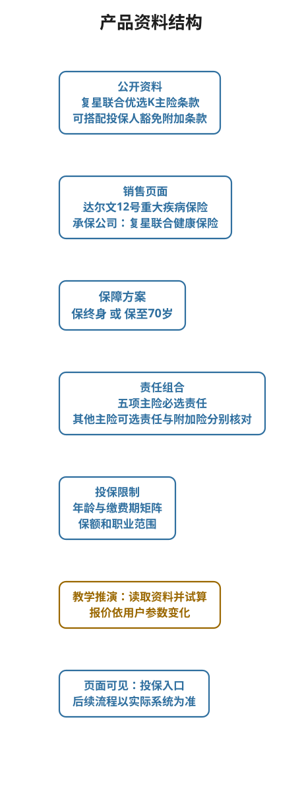
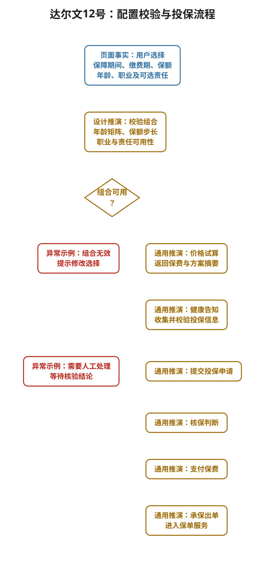

# 达尔文12号重疾险：从真实产品页读懂产品库

> 适用对象：准备平安金管家用户增长产品经理面试，想从具体保险产品理解产品结构、配置后台、投保流程与产品经理实际工作的读者。
>
> 案例观察日期：2026 年 9 月 27 日。产品页面和销售规则可能更新，面试前请重新打开来源核对。
>
> 学习目标：能独立解释页面上的每一个主要业务对象，画出产品资料进入销售页面的过程，判断一组投保条件能否继续试算，并说明产品经理如何设计和验收这类配置。

## 先看结论

用户给出的[达尔文12号重大疾病保险产品页](https://cps.qixin18.com/apps/cps/gw1070454/product/detail?prodId=105149&planId=130613&aid=56593e0b-c287-4281-82e2-b3bc081fece6)展示的是经纪或代理销售页面，当前链接选中“保终身”方案。页面写明承保公司为复星联合健康保险股份有限公司。该页列出的主条款名称为《复星联合优选K重大疾病保险（互联网）》，另列有可搭配的投保人豁免附加条款。页面上同时能切换“保至70岁”。

这几个名称承担不同职责：

| 页面上看到的词 | 本案例中的值 | 产品经理要理解的对象 |
| --- | --- | --- |
| 销售展示名称 | 达尔文12号重大疾病保险 | 用户识别和页面传播所用的名称 |
| 承保公司 | 复星联合健康保险股份有限公司 | 承担合同保险责任的主体 |
| 主险条款 | 复星联合优选K重大疾病保险（互联网） | 责任、条件和免责的合同依据 |
| 保障方案 | 保终身、保至70岁 | 可选保障期间及其关联配置 |
| 保险责任 | 首次重疾、中症、轻症等 | 发生约定情形时如何给付 |
| 附加险 | 投保人豁免保险费重大疾病保险 | 与主险搭配销售的另一份合同 |

**读法**：先认合同与承保主体，再看方案和责任，最后看投保条件与价格。销售名称、合同名称和页面标题需要建立对应关系，不能仅凭页面标题推断合同责任。

## 1. 事实边界与资料来源

本文用三种标记，便于面试时区分证据。

| 标记 | 含义 | 可以怎样表达 |
| --- | --- | --- |
| 【页面事实】 | 当前产品页或其链接资料直接披露 | “该页面显示……” |
| 【设计推演】 | 从页面需求倒推的常见后台做法 | “如果由我设计，会……” |
| 【个人经历待核对】 | 你在深蓝保项目中的具体做法尚未确认 | 确认后再用“我当时……” |

主要资料如下：

1. [产品详情页](https://cps.qixin18.com/apps/cps/gw1070454/product/detail?prodId=105149&planId=130613&aid=56593e0b-c287-4281-82e2-b3bc081fece6)：销售名称、方案、投保须知、常见问题和服务说明。
2. [保障责任对照表](https://files2.huizecdn.com/file3/M00/8E/8E/rBYA3GitInGABJt8AADhibPOvn0761.pdf)：两种保障期间对应的必选与可选责任。
3. [投保年龄上限表](https://files2.huizecdn.com/file3/M00/8E/8E/rBYA3GitInGAB4CfAAFqOUBpZ2s831.pdf)：保障期间、缴费年限与最高投保年龄的组合。
4. [费率表](https://files2.huizecdn.com/file3/M00/93/B8/rBYA3GjBmmKAEYgPAHMXdKbUv-Q299.pdf)：含责任组合对照和多页费率数据。本文只分析它对配置设计的意义，不从静态页面推算个人保费。
5. [投保须知书](https://files2.huizecdn.com/file3/M00/DE/B7/rBYA3GngpsmAWypPAAOMokCSsc0614.pdf)：承保主体、主险及附加险条款编号、责任、提示和投保规则。
6. [承保公司产品说明书](https://e.fosun-uhi.com/upload/pdf/%E5%A4%8D%E6%98%9F%E8%81%94%E5%90%88%E4%BC%98%E9%80%89K%E9%87%8D%E5%A4%A7%E7%96%BE%E7%97%85%E4%BF%9D%E9%99%A9%EF%BC%88%E4%BA%92%E8%81%94%E7%BD%91%EF%BC%89%E4%BA%A7%E5%93%81%E8%AF%B4%E6%98%8E%E4%B9%A6.pdf)：用于核对主险产品形态。具体给付始终以正式条款和保单约定为准。

页面 HTML 返回的数据中可见 `productId=105149`、`planId=130613`。它们可以说明页面需要区分产品与当前方案。仅凭页面返回值无法确定后台数据库表名、字段定义或保司内部编码。页面的“保费”展示区在本次静态读取中没有得到某位客户的有效报价，本文不写具体购买价格。

## 2. 一张结构图读懂这款产品

[打开可编辑的产品资料结构图](../../../90_内部材料_无需阅读/02_可编辑图源/达尔文12号/达尔文12号_产品资料结构.html)

图中上游合同资料与页面已披露对象属于【页面事实】。图中资料整理、配置发布及数据消费关系属于【设计推演】，用于学习产品库设计。

把产品拆成六层，更容易回答面试官的连续追问。

| 层次 | 本案例的具体内容 | 如果没有这一层，会出现什么问题 |
| --- | --- | --- |
| 合同依据 | 主险条款、投保须知、免责说明、费率文件，另有投保人豁免附加条款 | 页面文案难以追溯到正式约定 |
| 产品与方案 | 销售产品下有保终身、保至70岁两种保障方案 | 用户切换方案后，责任和缴费期无法一起变化 |
| 保险责任 | 五项基础必选责任与多项可选责任 | 保费和保障说明难以按所选责任组合生成 |
| 投保规则 | 年龄、缴费期、基本保额、职业等限制 | 页面允许选择无法投保的组合 |
| 价格与试算 | 费率文件、责任组合及用户输入 | 页面无法给出与所选方案一致的有效报价 |
| 状态与版本 | 资料版本、生效时间、渠道可售状态 | 改版后新旧页面及历史试算可能混用资料 |

这里的“层”是教学视角。实际公司可以采用不同服务、表或配置方式。产品经理首先要保证业务对象和规则一致，随后再与研发确认实现。

### 2.1 主险责任与附加险的区别

【页面事实】[保障责任对照表](https://files2.huizecdn.com/file3/M00/8E/8E/rBYA3GitInGABJt8AADhibPOvn0761.pdf)显示，两种保障期间都包含首次重大疾病、中度疾病、轻度疾病、住院津贴和疾病豁免保险费五项必选责任。身故或全残、重大疾病保费补偿和顶梁柱关爱可在两种期间选择。疾病关爱、重大疾病多次给付以及“恶性肿瘤重度”治疗津贴只在保终身方案列为可选。

投保人豁免在页面的条款区有单独附加条款。它需要单独识别为附加险，不应与主险内部的“疾病豁免保险费”责任合并。两者的被保险对象、触发条件和合同依据需要分别核对。

【设计推演】后台可把责任配置成“必选、可选、当前方案不可选”三种可用状态，再把附加险作为独立的组合对象。页面勾选责任时，既要更新保障说明，也要重新获取有效报价和投保校验结果。若两项责任存在不能同时选择的限制，应以正式资料为依据配置，本文不预设实际冲突规则。

## 3. 把真实规则翻译成后台校验

### 3.1 方案与缴费期

【页面事实】产品页投保须知列明，保终身可以选择趸交、5 年、10 年、20 年、30 年、35 年；保至70岁可以选择趸交、5 年、10 年、20 年。按[投保年龄上限表](https://files2.huizecdn.com/file3/M00/8E/8E/rBYA3GitInGAB4CfAAFqOUBpZ2s831.pdf)，年龄上限进一步随缴费年限变化。

| 缴费年限 | 保终身最高投保年龄 | 保至70岁最高投保年龄 |
| --- | --- | --- |
| 趸交 | 55 周岁 | 35 周岁 |
| 5 年 | 55 周岁 | 35 周岁 |
| 10 年 | 50 周岁 | 35 周岁 |
| 20 年 | 45 周岁 | 35 周岁 |
| 30 年 | 35 周岁 | 不提供 |
| 35 年 | 30 周岁 | 不提供 |

另有一个细节：选择保终身并附加“疾病关爱保险金责任”时，被保险人最高年龄为 35 周岁。说明某项可选责任也能改变可投范围。页面概要里的“0 至 55 周岁”不足以判断每一种组合。

【设计推演】后台的可投校验至少接收保障期间、缴费年限、被保险人年龄、可选责任。年龄应根据出生日期和产品指定的年龄口径计算，页面不能只用手填数字绕开规则。

### 3.2 保额与职业

【页面事实】投保须知列明基本保额最低 5 万元、最高 50 万元，按 5 万元递增；支持的被保险人职业为 1 至 4 类，单张保单年交保费不低于 500 元。具体保额规则另有附件，不能只凭概要把所有年龄和保额组合都认定为可投。

【设计推演】页面可以先拦截明显无效的步长和职业类别，提交投保前还需以当时有效的产品规则做最终校验。对于健康告知、智能核保或人工核保的实际结论，页面材料无法提前确定。

### 3.3 四组校验练习

以下案例只验证公开的年龄与缴费期矩阵，不代表已通过健康告知、保额细则和核保。

| 输入 | 按公开矩阵的初步判断 | PM 应说明的依据 |
| --- | --- | --- |
| 32 周岁，保终身，30 年交，不选疾病关爱 | 可进入下一步校验 | 30 年交最高 35 周岁 |
| 36 周岁，保终身，30 年交 | 当前组合不符合年龄上限 | 30 年交最高 35 周岁，可提示重新选择缴费期 |
| 30 周岁，保至70岁，30 年交 | 当前方案不提供该缴费期 | 保至70岁只列至 20 年交 |
| 36 周岁，保终身，20 年交，选疾病关爱 | 当前责任组合不符合年龄上限 | 保终身选择疾病关爱时最高 35 周岁 |

问自己三个问题：校验应在切换方案时触发，还是到提交时才触发？无效选项应隐藏、置灰，还是允许点击后说明原因？用户修改缴费期后，已选责任和报价如何处理？这些是产品经理需要明确的交互与数据一致性问题。

## 4. 从用户选择到承保的流程

[打开可编辑的配置校验与投保流程图](../../../90_内部材料_无需阅读/02_可编辑图源/达尔文12号/达尔文12号_配置校验与投保流程.html)

图的前段选项和约束可从产品页及资料核对。健康告知后的具体系统路由、自动核保与人工处理、支付和出单节点属于【设计推演】，用于理解保险交易链路，不能当作该页面或深蓝保的真实内部流程。

1. 用户选择保终身或保至70岁，页面刷新该方案允许的缴费期和责任。
2. 用户输入出生日期、职业、基本保额并选择可选责任，前端进行即时提示。
3. 系统用当前有效配置再次校验组合，获取报价所需输入和价格结果。若组合无效，返回具体原因和可调整项。
4. 用户阅读保障责任、免责、费率和投保须知，再进入健康告知与投保申请。
5. 投保申请之后的核保、支付、承保出单和电子保单服务，依实际承保系统和该渠道流程执行。

页面还展示 180 天等待期和 15 天犹豫期。等待期涉及保险责任生效后的约定，犹豫期涉及收到保单后的合同解除权。两者都应出现在用户理解产品的关键位置，不能当成价格选择参数。

## 5. 产品经理怎样设计这套配置

### 5.1 先确定资料权威与对象边界

【设计推演】接到产品上线需求时，先建立资料清单：正式条款、产品说明书、投保须知、责任对照、年龄与缴费期矩阵、费率文件、健康告知和免责说明。每份资料记录来源、版本、生效时间、确认人和变更记录。经纪平台的展示文案必须能回到合同或正式说明资料核对。

随后整理一份业务对象词典：

| 教学字段 | 业务含义 | 本案例要核对的点 |
| --- | --- | --- |
| display_product | 销售页面展示的产品 | 达尔文12号与正式主险条款的映射 |
| coverage_plan | 保障期间方案 | 保终身或保至70岁 |
| payment_period | 缴费年限 | 当前方案是否提供该选项 |
| liability_selection | 必选及可选责任 | 当前方案支持什么责任 |
| insured_age | 被保险人年龄 | 以有效年龄口径匹配年龄上限表 |
| sum_assured | 基本保额 | 先校验范围与步长，再核对详细规则 |
| occupation_class | 职业类别 | 当前产品支持 1 至 4 类 |
| quote_version | 本次试算的资料组合版本 | 能否复现报价并处理产品改版 |

这些字段名只用于讲解，不对应真实系统表结构。页面返回的 `productId` 与 `planId` 可帮助识别当前展示对象，实际跨系统编码映射需要研发和业务共同核对。

### 5.2 把规则变成可验收的决策表

以“保终身，30 年交”为例，可先形成以下小表，再逐步补齐其他组合。

| 条件 | 期望动作 | 资料依据 |
| --- | --- | --- |
| 被保险人年龄不超过 35 周岁 | 继续检查其他条件 | 年龄上限表 |
| 被保险人年龄超过 35 周岁 | 提示该缴费期不可投 | 年龄上限表 |
| 同时选择疾病关爱 | 继续执行该责任的年龄限制 | 年龄上限表附注 |
| 保额不在 5 万至 50 万之间或不按 5 万递增 | 阻止试算或提交，说明可选范围 | 投保须知与保额附件 |

这张表还缺少健康告知、详细保额限制、费率、核保等条件。产品经理要把“已核对”“待确认”“由承保系统最终判断”分别写清，防止页面把局部校验误当最终可承保承诺。

### 5.3 报价与价格展示

【设计推演】报价的输入至少包含保障期间、缴费期、年龄、性别、基本保额和可选责任。投保人豁免若被选择，还可能需要投保人相关输入及附加险费率，具体以费率文件和报价服务为准。

产品页链接的[费率表](https://files2.huizecdn.com/file3/M00/93/B8/rBYA3GjBmmKAEYgPAHMXdKbUv-Q299.pdf)先列出多种责任组合，再包含大量费率页。这说明“一个产品一个价格”的页面模型不足以表达完整报价。页面展示的起始价或营销价不能直接代替客户实际报价，需求中应写明价格的输入、版本、单位、舍入、失效和重新计算规则。

报价能力可以由承保方接口、经核验的平台计算服务或其他授权方式提供。选择方案时要比较权威来源、变更同步、响应时延、故障处理与对账方式。本文无法从产品页识别其实际报价实现。

### 5.4 如果设计配置后台，页面如何分工

以下为【设计推演】。它是一份可以用于练习 PRD 的后台页面地图，并不表示慧择或复星联合实际采用这些页面。

| 后台能力 | 需要维护的内容 | 保存或发布前的关键检查 | 主要消费方 |
| --- | --- | --- | --- |
| 产品主档 | 展示名、承保公司、主险条款关联、产品分类 | 名称与合同资料能追溯 | 产品列表、详情页 |
| 方案配置 | 保终身、保至70岁及保障期间 | 方案有对应责任和缴费期 | 详情页方案切换 |
| 责任组合 | 必选、可选、不可选、附加险搭配 | 页面说明与正式责任对照表一致 | 保障权益、报价输入 |
| 投保限制 | 年龄矩阵、保额、职业及其他条件 | 覆盖边界和无效组合 | 试算、投保申请 |
| 费率与报价 | 费率资料、计算来源、舍入及报价有效性 | 与权威样例对平 | 页面保费、顾问工具 |
| 材料与渠道 | 条款、须知、告知、免责和渠道可售范围 | 链接可打开，材料版本匹配 | 页面披露、顾问展业 |
| 审批与发布 | 变更单、复核、上线时间、回滚预案 | 关键角色确认，旧版可追溯 | 所有消费端 |

这张表可以倒推四个需求问题：谁有权编辑费率和责任，谁负责复核，哪些变更必须生成新版本，发布后如何确认页面和报价同时生效。具体权限与审批节点应按公司制度确定。

## 6. 上线、版本和故障怎样处理

### 6.1 一次规则改动会影响哪些位置

【设计推演】假设某方案的投保年龄上限发生正式调整。发布前要逐项检查：资料依据、年龄表、页面选项、报价输入、投保前校验、顾问端素材、历史链接提示和回归样例。若只改页面文案，用户仍可能在报价或投保时被拦截。发布时要记录适用的生效时间和销售渠道。

历史试算或分享链接需要决定展示当时结果、提示过期，还是重新试算。用户继续投保前，应明确提示产品资料变化并重新确认关键输入。已承保保单应依据其合同及承保时适用资料提供服务，具体版本实现需看实际系统。

举一个完整的【教学模拟】变更：假设保终身方案的 30 年交年龄上限依据正式资料从 35 周岁调整为 34 周岁。产品运营先提交新资料和生效时间，PM 列出影响页面、报价及投保校验的清单，研发配置新规则并保留旧版追溯，测试覆盖 34 岁、35 岁及已保存的历史试算。发布前核对页面提示、费率输入、顾问素材和历史链接，发布后监测组合拦截与报价错误。这里的“调整”为练习设定，并非该产品已经发生的变更。

### 6.2 四个面试可练的模拟故障

| 模拟现象 | 第一处排查 | 协作与修复 | 回归验证 |
| --- | --- | --- | --- |
| 36 岁用户仍能选“保终身，30 年交” | 页面年龄计算和当前年龄矩阵 | 与产品运营确认资料，研发检查校验时机与版本 | 35 岁边界、36 岁拦截，切换 20 年交后重新报价 |
| 切到保至70岁后仍展示疾病关爱 | 方案责任可用矩阵和旧选项状态 | 确认责任对照，清理无效勾选并提示用户 | 方案往返切换，页面、报价与投保申请一致 |
| 选择投保人豁免后保费未变化 | 附加险是否进入报价输入及返回 | 核对附加条款和费率，研发排查编码映射 | 主险单独报价与加入附加险后的结果均与权威样例核对 |
| 旧分享链接展示新方案价格 | 历史试算是否保存输入、版本与结果 | 明确历史展示和重新试算策略 | 新旧版本链接、失效提示及再次投保校验 |

这些都是【教学模拟】。在面试中可说“如果遇到这类问题，我会这样定位”。只有确认自己在深蓝保确实处理过的故障，才能改写成个人项目经历。

### 6.3 上线验收清单

1. 资料完整：条款、投保须知、责任矩阵、年龄矩阵、费率和页面文案能够互相追溯。
2. 组合正确：两种保障期间、所有提供的缴费期、必选和可选责任均按有效规则展示。
3. 边界正确：年龄上限、保额步长、职业范围和不可选责任的边界样例能通过。
4. 报价正确：典型与边界样例和权威参考结果对平；错误或超时有明确处理。
5. 用户理解正确：保障说明、免责、等待期、犹豫期、健康告知入口清晰。
6. 变更可追：能定位销售渠道、资料版本、报价输入和结果，更新后能完成新旧场景回归。

## 7. 连接你的深蓝保经历

你此前确认的真实参与范围是**年金试算或计划书的需求定义、联调和验收**。本案例是重疾险，适合练习产品结构和规则，不应说成你在深蓝保负责过达尔文12号或这款重疾险的后台。

| 可以迁移的能力 | 年金试算中的问题 | 本案例中的对应问题 |
| --- | --- | --- |
| 输入与输出定义 | 交费、领取安排与利益演示怎样对应 | 保障期间、缴费期和责任怎样对应报价 |
| 资料口径 | 年金领取与现金价值怎样区分 | 主险责任、可选责任和附加险怎样区分 |
| 联调与验收 | 页面与计划书结果怎样核对 | 页面责任、报价与投保申请怎样核对 |
| 版本与追溯 | 旧试算结果如何解释 | 旧产品链接与新销售规则如何处理 |

你可以这样回答经验问题，方括号需要真实回忆后填写：

> 我在深蓝保参与过年金试算或计划书相关需求，负责需求定义，并参与联调和验收。当时面对的用户问题是[待确认]，我负责的具体产物是[待确认]，联调时核对了[待确认]，验收时使用了[待确认的样例或方法]。今天如果看达尔文12号这类重疾险页面，我会先拆产品、方案、责任、投保规则和报价，再检查用户选择是否能在展示、试算和投保间保持一致。后半段是我基于公开资料做的案例分析。

面试官若问“你做过产品库后台吗”，把参与过的消费端需求、联调和验收说明白，再展示你能从下游倒推产品库需要提供的数据与规则。保司条款制定、精算定价和产品发布流程属于学习后的业务理解，具体亲历范围需以你自己的项目记录为准。

## 8. 三层追问与练习

| 面试官追问 | 答题骨架 |
| --- | --- |
| 产品和计划是什么关系 | 产品承载合同与销售资料，计划决定保障期间及一组可选配置；本页有保终身和保至70岁 |
| 为什么年龄上限不能写死为 55 岁 | 还受缴费期、保障期间及部分责任选择影响；举 30 年交和疾病关爱的例子 |
| 必选责任、可选责任和附加险如何建模 | 先按正式资料拆责任，再按方案配置可用性；附加险保留独立合同关联 |
| 价格怎么算 | 先列报价输入和来源，再让权威费率或服务计算；当前页面无法推断内部实现或给出用户价格 |
| 切方案时要检查什么 | 责任、缴费期、年龄上限、旧勾选、报价和提示文案同步更新 |
| 改版后旧链接怎么办 | 先确认版本和生效范围，再选择保留历史、提示过期或重新试算；继续投保前重新确认 |
| 你亲自做过哪些 | 回到年金试算或计划书的需求、联调和验收，具体产物、问题、结果用真实证据回答 |

### 自测

1. 不看图，用一分钟说出本案例的承保公司、销售名、主险条款名和两种保障方案。
2. 解释“36 岁、保终身、30 年交”为什么不能仅凭页面总览的“0 至 55 周岁”判断可投。
3. 说出保至70岁比保终身少了哪些可选责任类别。
4. 画出用户选择方案到报价前至少四项必要校验。
5. 用 90 秒回答“这款产品的配置后台应该怎么设计”，并标明哪些是公开事实、哪些是你的设计推演。

### 参考答案要点

1. 复星联合健康保险；达尔文12号；复星联合优选K重大疾病保险（互联网）；保终身和保至70岁。
2. 30 年交在终身方案的被保险人年龄上限为 35 周岁，还需继续核对职业、保额、健康告知等条件。
3. 疾病关爱、重大疾病多次给付和“恶性肿瘤重度”治疗津贴只在保终身方案列为可选。
4. 至少检查保障期与缴费期组合、年龄矩阵、保额规则、职业范围和可选责任兼容性。
5. 先建立合同与页面映射，再配置方案和责任、限制组合、报价输入、资料版本及验收样例。不得把教学字段或推演架构当作实际公司实现。

完成这五题后，再读[《深蓝保产品库实战图解手册》](../../03_平安面试准备/01_深蓝保产品库面试手册.md)中的年金试算数据流、联调样例和个人经历回忆表。两份手册分别承担真实产品拆解与个人项目复盘。
